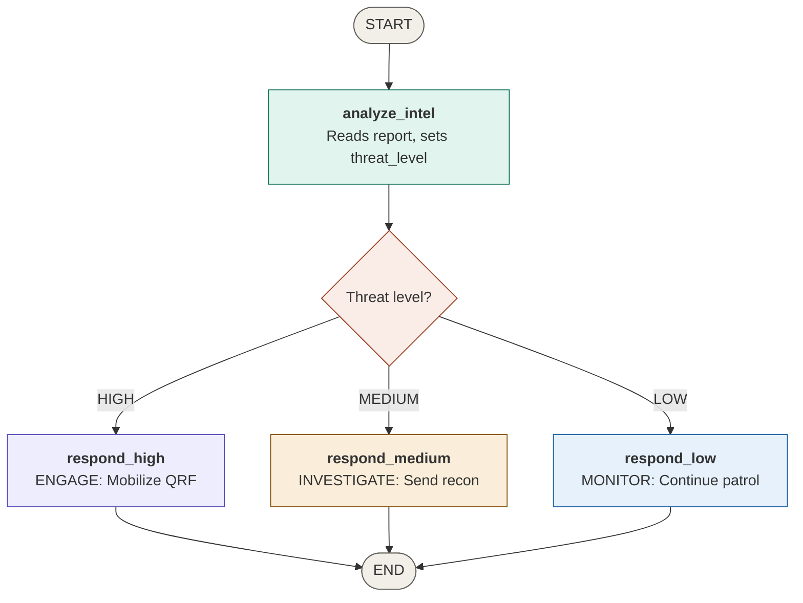
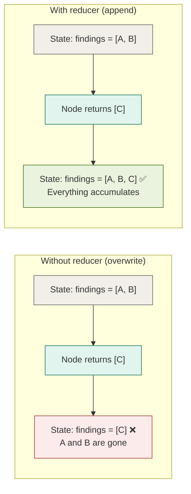
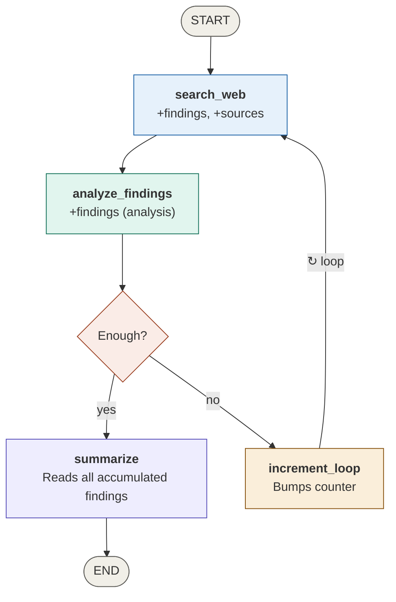
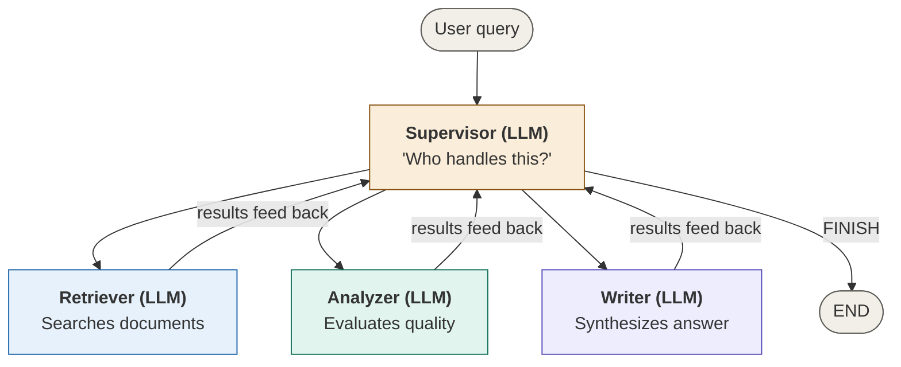
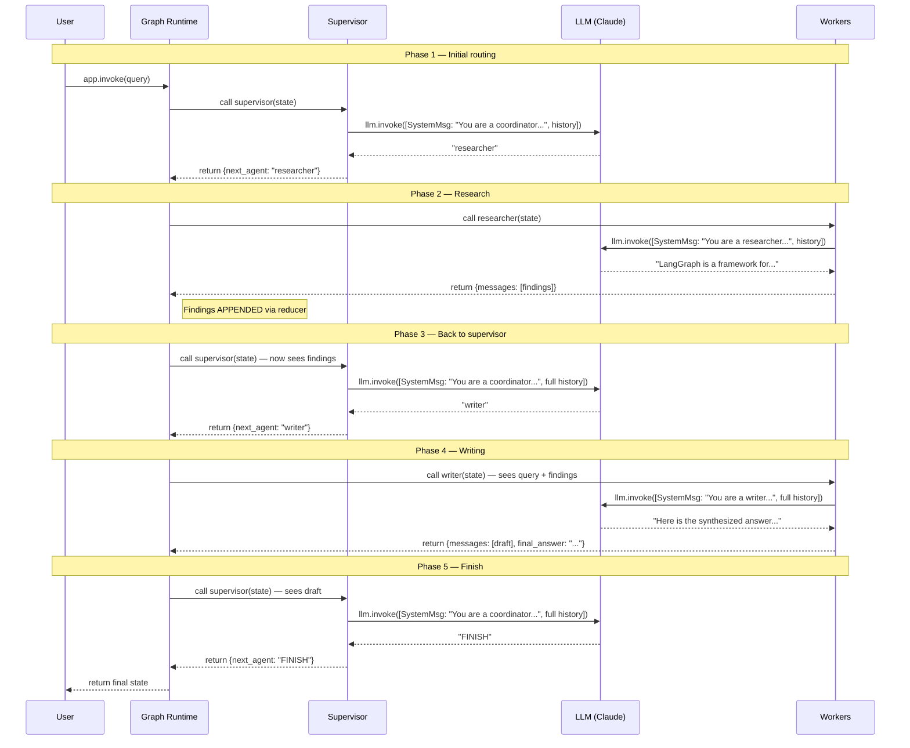
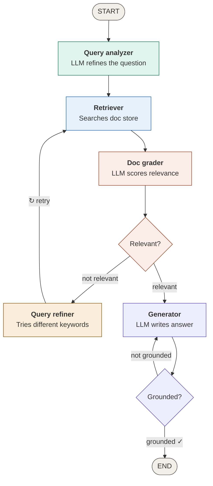

# LangGraph in Four Hours

**A practitioner's guide to building stateful multi-agent systems**

*For engineers who know Python and have used LLMs but haven't orchestrated them.*

---

## Who this is for

You've called an LLM API. Maybe you've chained a few calls together. But the moment you needed one LLM to make a decision, another to act on it, a quality check in between, and a retry loop when things go sideways — you realized you were writing spaghetti. Global variables, nested if/else blocks, no way to pause and resume, no audit trail.

LangGraph fixes that. It gives you a graph-based orchestration layer where LLMs live inside nodes, state flows between them, and the wiring handles routing, loops, and checkpoints.

This guide will take you from zero to a production-pattern multi-agent RAG pipeline in four hours. Each hour builds on the last. By the end, you'll have the vocabulary, the mental model, and a working project to point to.

---

## The mental model

Before touching code, you need a picture in your head. If you've served in the military, this will click instantly. If not, the analogy still holds.

A LangGraph application is a **mission operations order turned into code.**

In the military, you have a structured flow: receive intelligence, the commander makes a decision, execute one of several courses of action, debrief. Every step reads from and writes to the same shared picture — the Common Operational Picture, or COP. No one operates in isolation. The intel section doesn't run off and do its own thing; it updates the COP, and the operations section reads from it.

LangGraph works identically:

- **State** is the COP. A shared data object that every node can read from and write to. It's defined once, as a Python `TypedDict`, and it flows through the entire graph.
- **Nodes** are individual staff sections. Each node is a plain Python function that does one job: analyze intel, generate a response, check quality. It receives the full state, does its work, and returns only the fields it wants to update.
- **Edges** are the arrows on your flowchart. A fixed edge says "after this node, always go to that node." A conditional edge says "after this node, run a routing function to decide where to go next."
- **The Graph** is the full OPORD, compiled and executable. Once you wire it up and call `.compile()`, it becomes a runnable application.

The key insight: **nodes don't know about each other.** The intel section doesn't call the operations section directly. The graph handles that routing. This is what makes the system composable — you can swap, add, or remove nodes without touching the others.

Here's the OPORD as a graph:



Every graph you'll ever build follows this pattern: START → nodes doing work → conditional routing → END, all reading/writing to the same shared State.

---

## Hour 1 — The wiring diagram

### Core vocabulary

Five terms. That's the entire API surface that matters:

**`StateGraph`** is the blueprint. You create one, add nodes and edges to it, then call `.compile()` to get a runnable application.

**`State`** (defined as a `TypedDict`) is the shared data object. Every node receives it as input. Every node returns a dictionary of updates — only the fields it wants to change. Fields not included in the return stay untouched. Think of `TypedDict` as a regular Python dictionary but with a contract: "these specific keys exist, and their values are these specific types." At runtime it's still just a dict — the types only exist for your editor's autocomplete and for LangGraph to know the schema.

**Node** is a plain Python function. It takes state in, does one thing, and returns a dict of state updates. That's it. No special base class, no decorators, no magic.

**Edge** is a fixed connection. "After node A, always go to node B." You wire these with `graph.add_edge("a", "b")`.

**Conditional Edge** is a decision point. Instead of a fixed target, you provide a router function that reads the state and returns the *name* of the next node as a string. The graph follows wherever the router points.

### The pattern

Every LangGraph application follows the same skeleton:

```python
from typing import TypedDict
from langgraph.graph import StateGraph, START, END

# 1. Define the state schema
class MyState(TypedDict):
    input_field: str
    output_field: str

# 2. Define nodes (plain functions)
def my_node(state: MyState) -> dict:
    result = do_something(state["input_field"])
    return {"output_field": result}

# 3. Define routers (for conditional edges)
def my_router(state: MyState) -> str:
    if state["output_field"] == "done":
        return "finish_node"
    return "retry_node"

# 4. Wire the graph
graph = StateGraph(MyState)
graph.add_node("my_node", my_node)
graph.add_edge(START, "my_node")
graph.add_conditional_edges("my_node", my_router, {...})
graph.add_edge("finish_node", END)

# 5. Compile and run
app = graph.compile()
result = app.invoke({"input_field": "hello", "output_field": ""})
```

That's the template. Every graph you build — from a two-node prototype to a twenty-node production system — follows this shape.

---

## Hour 2 — The traffic controller

### The problem with overwriting

In Hour 1, every node overwrites state fields. Node A sets `threat_level`, node B sets `action`. Clean and simple — until you need **accumulation.**

Imagine a research pipeline: a retriever finds 3 documents, an analyzer reviews them and adds notes, a second retriever pass finds 2 more. If each node overwrites the `documents` field, you lose everything the previous node found. The analyzer's notes obliterate the retriever's results.

This is the most common state management failure in LangGraph applications, and the fix is a single annotation.

### State reducers

A reducer tells LangGraph *how* to combine a node's return value with the existing state, instead of just replacing it.

```python
from typing import Annotated
from operator import add

class ResearchState(TypedDict):
    query: str                                  # No reducer → overwrites
    findings: Annotated[list[str], add]         # Reducer → appends
```

The syntax is `Annotated[type, reducer_function]`. The reducer `operator.add` performs list concatenation. When a node returns `{"findings": ["new fact"]}`, LangGraph does:

```python
state["findings"] = state["findings"] + ["new fact"]   # Concatenation, not replacement
```

Here's why this matters:



Three nodes can all contribute findings, and nothing gets lost. This is what makes multi-agent collaboration possible — agents can write to the same field without stomping on each other.

**The return type must match.** If your reducer uses `operator.add` on lists, every node must return a *list* for that field — even if it's a list with one item. Returning a bare string when the reducer expects a list will cause a TypeError.

### Conditional loops

Hour 1 graphs are linear: START → nodes → END. Hour 2 introduces cycles.

A conditional edge can route *backward* in the graph. If a quality gate decides "not enough data," it can route back to a retriever node. The retriever runs again, appends more findings (via the reducer), and the quality gate re-evaluates.



This is not a Python `while` loop. It's a graph cycle managed by LangGraph. The difference matters because:

- LangGraph checkpoints state at every node boundary during the loop
- The loop can be interrupted and resumed (human-in-the-loop)
- You can inspect the state at any iteration after the fact
- A Python `while` loop offers none of these

**Always include a loop guard.** Without one, a conditional loop can run forever if the exit condition is never met. Use a retry counter in your state, and have your router check it: "if we've looped 3 times, proceed anyway."

### Checkpointing

Checkpointing saves a snapshot of the state at every node transition. You enable it by passing a checkpointer to `.compile()`:

```python
from langgraph.checkpoint.memory import MemorySaver

memory = MemorySaver()
app = graph.compile(checkpointer=memory)
```

When using a checkpointer, every `.invoke()` call requires a `thread_id` in the config — think of it as a session ID. Same thread = same state history. Different thread = fresh start.

```python
config = {"configurable": {"thread_id": "session-1"}}
result = app.invoke(initial_state, config=config)
```

`MemorySaver` stores snapshots in memory (lost when the process exits). For production, use `SqliteSaver` (local file) or `PostgresSaver` (database). The API is identical — swap the checkpointer, keep everything else.

Why this matters: checkpointing gives you a full audit trail of every state transition. You can inspect what happened at any step, replay from any checkpoint, and implement human-in-the-loop by pausing at a gate node and waiting for approval before resuming.

---

## Hour 3 — The crew chief

### Where the LLM fits

Here's the question that matters: **LangGraph is the wiring. Where does the AI actually go?**

Inside the nodes.

Up through Hour 2, our nodes used if/else logic — keyword matching, threshold checks. That was deliberate: learn the plumbing before turning on the water. But in production, nodes are LLM calls:

```python
# Hour 1 node (no AI)
def analyze(state):
    if "enemy" in state["report"].lower():
        return {"threat_level": "HIGH"}
    return {"threat_level": "LOW"}

# Production node (AI inside)
def analyze(state):
    response = llm.invoke(f"Classify this report: {state['report']}")
    return {"threat_level": response.content}
```

Same node interface. Same graph wiring. The only thing that changed is what happens inside the function. The LLM is the person sitting in the staff section seat — LangGraph doesn't care whether it's a keyword matcher or Claude. It just knows the node runs, reads state, and returns updates.

### The message pattern

When you call an LLM in production, you don't send a raw string. You send a list of *message objects* with roles:

```python
from langchain_core.messages import SystemMessage, HumanMessage

response = llm.invoke([
    SystemMessage(content="You are a security analyst."),
    HumanMessage(content="Assess this log entry: ..."),
])
```

`SystemMessage` sets the agent's personality and instructions. `HumanMessage` is the task. The LLM responds in character based on the system message.

This is how one LLM becomes multiple specialists. The supervisor node sends `SystemMessage("You are a coordinator. Decide who goes next.")`. The researcher node sends `SystemMessage("You are a researcher. Find relevant facts.")`. Same underlying model, different hat each time.

### The supervisor pattern

The supervisor pattern is the most common multi-agent architecture. One node (the supervisor) uses an LLM to decide which specialist node should run next:



The flow:

1. **Supervisor** reads the conversation state, asks the LLM "who should handle this?", and sets a `next_agent` field in state.
2. **A conditional edge** reads `next_agent` and routes to the appropriate worker node.
3. **Worker nodes** (researcher, writer, analyst, etc.) each do their specialized task and return updates to state.
4. **All workers route back to the supervisor**, which re-evaluates: "do we need another specialist, or are we done?"
5. When the supervisor returns `"FINISH"`, the conditional edge routes to END.

The loop is *agent-driven*. No hardcoded iteration count — the supervisor LLM decides when the job is done. The graph just follows orders.

### Messages as state

Multi-agent systems typically use a message list as the primary state field, with a reducer so messages accumulate:

```python
class AgentState(TypedDict):
    messages: Annotated[list[BaseMessage], add]
    next_agent: str
```

Agents communicate by appending messages. The researcher writes `[Researcher]: I found these three documents.` The writer reads that and writes `[Writer]: Here's my synthesis.` The supervisor reads everything and decides what's next. The full conversation is automatically available to every node — no manual passing required.

### UML sequence diagram: what actually happens at runtime

This is the diagram that makes the back-and-forth between the graph runtime, nodes, and the LLM concrete. Step through it carefully — this is the execution model you need to internalize.



Key observations:

- **The LLM is called multiple times, by different nodes, with different prompts.** Same Claude under the hood, but each node gives it a different `SystemMessage` — so it behaves like a different specialist each time.
- **The Graph Runtime is the traffic cop.** It never touches the LLM directly. It just calls nodes in the right order, passes state, and evaluates conditional edges.
- **State accumulates across calls.** Each worker appends to the message list via the reducer. By Phase 4, the writer sees the original query *and* all research findings.

### Tool calling (preview)

You can give LLM-powered nodes the ability to call Python functions:

```python
from langchain_core.tools import tool

@tool
def search_docs(query: str) -> str:
    """Search the document store."""
    return vector_store.similarity_search(query)

llm_with_tools = llm.bind_tools([search_docs])
response = llm_with_tools.invoke(messages)
```

`bind_tools()` tells the LLM "these functions are available to you." The LLM decides *when* to call them based on the conversation. LangGraph's prebuilt `ToolNode` handles executing the calls. This is how a retriever agent actually searches a vector store — the LLM generates the query, the tool executes the search, and the results flow back through state.

---

## Hour 4 — The portfolio piece

### Architecture: multi-agent RAG pipeline

Everything from Hours 1–3 converges into a production-pattern Retrieval-Augmented Generation pipeline. Six nodes, two quality gates, two feedback loops:



**Query Analyzer** → Takes the user's raw question and produces an optimized search query. (An input transformation gate — in production, you'd add prompt injection detection here.)

**Retriever** → Searches the document store using the refined query. (Swap the guts for FAISS, Pinecone, ChromaDB, or any vector store. The node interface stays the same.)

**Document Grader** → LLM-as-judge evaluates whether retrieved documents are relevant to the query. (A retrieval validation gate — prevents irrelevant context from polluting the generation.)

**Generator** → Synthesizes an answer from the relevant documents, constrained to only cite provided evidence. (The core RAG contract: ground the answer in retrieved context.)

**Hallucination Checker** → LLM-as-judge verifies the generated answer is supported by the source documents. (Output validation — the last gate before the answer reaches the user.)

**Query Refiner** → When documents aren't relevant, refines the search query and routes back to the retriever. (Self-correction loop with a retry counter to prevent infinite cycling.)

### Two feedback loops

**Retrieval loop:** If the document grader says "not relevant," the query refiner generates a better search query and routes back to the retriever. The documents field has a reducer, so new results accumulate alongside previous ones.

**Generation loop:** If the hallucination checker says "not grounded," the graph routes back to the generator for another attempt with the same evidence.

Both loops have retry guards. After a configurable number of retries, the pipeline proceeds with the best available result rather than looping forever.

### The doc grader in production

The document grader node deserves special attention because it's where domain expertise lives. A simple "relevant / not relevant" binary works for demos, but production graders need:

**Domain-specific criteria.** A legal RAG grader needs to know about jurisdiction relevance, whether case law has been overturned, and whether a source is primary or secondary authority. A medical RAG grader needs to assess recency, evidence level, and guideline applicability. These criteria live in the `SystemMessage` prompt, which might be 500+ words of evaluation rubric.

**Scoring rubrics over binary decisions.** Instead of yes/no, use a 1–5 relevance scale with explicit definitions for each level. Set a threshold ("only pass documents scoring 4+") and you have a tunable quality dial.

**Few-shot examples.** The single biggest quality improvement for any LLM-as-judge node is providing graded examples: "Here's a document that scored 5, and here's why. Here's one that scored 2, and here's why." The LLM calibrates to your standard.

**Multi-dimensional grading.** Instead of one grader node doing everything, split into a relevance grader, a recency grader, and a source-authority grader — three nodes in sequence, each appending their score to state via a reducer. The graph topology handles orchestration; each prompt stays focused.

The graph architecture stays the same. The prompts inside the nodes are where the domain expertise lives. In an interview, being able to articulate this distinction — "the orchestration is generic but the evaluation criteria are domain-specific and heavily prompt-engineered" — is the signal that you understand where the real work happens in production.

---

## The concepts that matter on a resume

If you've worked through the four exercises, you can speak fluently about:

**State management.** `TypedDict` for schema definition, `Annotated` with `operator.add` for reducers, the difference between accumulating and overwriting state fields, and why this matters for multi-agent collaboration.

**Graph composition.** Nodes as isolated functions with clear reads/writes contracts, fixed edges for deterministic flows, conditional edges for dynamic routing, and graph cycles for retry loops.

**LLMs as node internals.** The pattern of `SystemMessage` + `HumanMessage` → `llm.invoke()` → `response.content`, and how different system prompts create different specialist personas from the same underlying model.

**The supervisor pattern.** One LLM routing to specialist LLMs, with workers reporting back to the supervisor, and the supervisor deciding when to stop.

**Checkpointing.** `MemorySaver` for development, `PostgresSaver` for production. Thread IDs for session management. The ability to inspect, replay, and pause/resume at any node boundary.

**Quality gates.** LLM-as-judge nodes for document relevance grading and hallucination checking, with configurable retry loops and guard conditions.

### Vocabulary that signals depth

- State reducers and `Annotated` types
- Conditional edges and router functions
- `MemorySaver` vs `PostgresSaver`
- Thread IDs for session management
- `compile()` vs `invoke()` vs `stream()`
- LLM-as-judge pattern
- Feedback loops with retry guards
- Human-in-the-loop via checkpointing

---

## Quick reference

### Minimal graph skeleton

```python
from typing import Annotated, TypedDict
from operator import add
from langgraph.graph import StateGraph, START, END
from langgraph.checkpoint.memory import MemorySaver

class State(TypedDict):
    query: str
    results: Annotated[list[str], add]

def node_a(state: State) -> dict:
    return {"results": ["something"]}

def router(state: State) -> str:
    return "done" if len(state["results"]) > 3 else "continue"

graph = StateGraph(State)
graph.add_node("node_a", node_a)
graph.add_edge(START, "node_a")
graph.add_conditional_edges("node_a", router, {"done": END, "continue": "node_a"})

app = graph.compile(checkpointer=MemorySaver())
result = app.invoke({"query": "test", "results": []}, {"configurable": {"thread_id": "1"}})
```

### LLM node pattern

```python
from langchain_anthropic import ChatAnthropic
from langchain_core.messages import SystemMessage, HumanMessage

llm = ChatAnthropic(model="claude-sonnet-4-20250514")

def my_agent(state):
    response = llm.invoke([
        SystemMessage(content="You are a specialist in X."),
        HumanMessage(content=state["query"]),
    ])
    return {"answer": response.content}
```

### Common reducer patterns

```python
# Append lists
findings: Annotated[list[str], add]

# Accumulate messages
messages: Annotated[list[BaseMessage], add]

# Custom reducer (keep unique items only)
def unique_add(existing: list, new: list) -> list:
    return list(set(existing + new))

tags: Annotated[list[str], unique_add]
```

---

*Built during a 4-hour sprint. Exercises available in the companion code files.*
